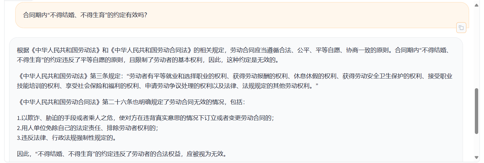

# 劳动法知识库检索助手

**_OpenXLab 体验地址：_**

**_劳动法知识库检索助手 模型下载地址：_**

- **_OpenXLab:_**

> _此仓库主要将 劳动法知识库助手项目 部署到 OpenXLab 上。_

## 介绍

劳动法知识库助手是利用自然语言处理技术，对劳动法相关的法律文本进行分析，提取关键信息，构建知识库，实现劳动法相关问题的检索。它基于[InternLM2](https://github.com/InternLM/InternLM.git)进行 QLoRA 微调，同时结合 RAG 技术实现知识库的构建。

## 数据集

劳动法知识库助手 数据集采用路径`data/`下的劳动法相关政策文件和案例文件作为数据集，使用[create_db.py](dataset/create_db.py)使用 Chroma 创建向量数据库，使用[gen_dataset.py](dataset/gen_dataset.py)生成微调数据集。

## 微调

使用 Xtuner 进行微调，具体配置脚本可参考[internlm2_chat_7b_qlora_oasst1_e3_copy.py](configs/internlm2_7b_qlora_oasst1_e3_copy.py)，该文件在`train`文件夹中，脚本内有详细的参数解释。

## RAG

使用 RAG 技术构建知识库，通过[LLM.py](LLM.py)读取向量数据库，并接入 InternLM2 模型到 LangChain 中，构建检索问答链，实现劳动法知识库的检索。

## Demo 展示

劳动法知识库助手的 Demo 展示可参考[app.py](app.py)文件，通过 Gradio 搭建 Web 服务，实现劳动法知识库的检索功能。

## 效果展示

实际的问答效果展示如下：

